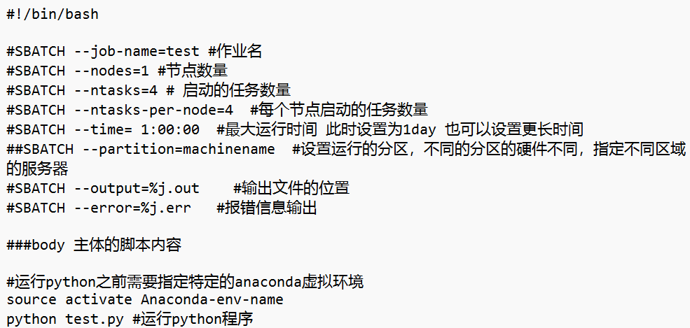
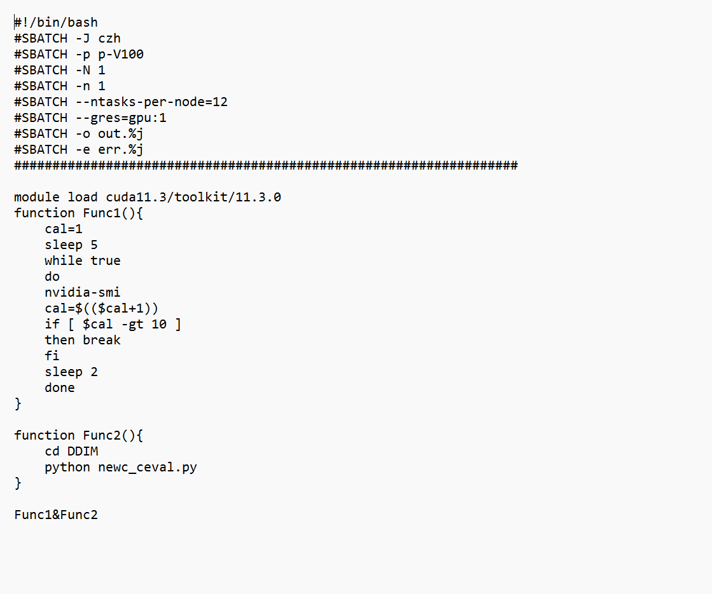

# Slurm With GPU
SLURM （Simple Linux Utility for Resource Management）是一种可扩展的工作负载管理器，已被全世界的国家超级计算机中心广泛采用。 它是免费且开源的，根据GPL通用公共许可证发行。

GPU集群是一个计算机集群，其中每个节点配备有图形处理单元（GPU）。通过图形处理单元（GPGPU）上的通用计算来利用现代GPU的计算能力，可以使用GPU集群执行非常快速的计算。GPU集群可以使用来自两个主要独立硬件供应商的硬件（AMD和NVIDIA）。

由于跨系统文本编码的问题，我们强烈建议您只用英文字符和数字命名文件夹和目录，并且不要使用特殊字符，以确保作业能顺利运行。

以下是个人在使用GPU集群时记录的一些操作步骤与心得体会，如有问题请及时指正！

Step 1: anaconda的安装与conda虚拟环境的激活（该部分在之前的仓库中有提及，请参阅）

Step 2: 任务/作业提交

**注意：使用GPU集群运行自己的代码时，与在普通的以Ubuntun系统上搭建的服务器不同，我们知道在普通的服务器上运行代码的时候只需要cd到相应目录，并输入python XXXX.py即可运行，但是使用GPU集群来运行自己的代码时并不是如此。**
原因是因为GPU集群依赖于Slurm这一作业调度系统，要求用户通过撰写shell脚本的方式提交脚本作业（包括作业命令与资源申请），其次加入运行队列等待排队，最后输出作业结果，其大致流程图如下：

按照上述流程，我们首先要撰写一个shell脚本（举个例子）

具体内容包括如下：

SBATCH --job-name=test #作业名

SBATCH --nodes=1 #节点数量（一个节点就是一台计算机）

SBATCH --ntasks=4 # 启动的任务数量

SBATCH --ntasks-per-node=4  #每个节点并行的进程数量

SBATCH --time= 1:00:00  #最大运行时间 此时设置为1day 也可以设置更长时间

SBATCH --partition=machinename  #设置运行的分区，不同的分区的硬件不同，指定不同区域的服务器

SBATCH --output=%j.out    #输出文件的位置

SBATCH --error=%j.err   #报错信息输出

写完脚本后，我们利用sbatch(批处理模式)将脚本提交，比如：sbatch submission.sh(假设我的shell脚本名字为submission)。

注：slurm 有三种模式提交作业，分别为交互模式，批处理模式，分配模式，这三种方式只是作业提交方式的区别，在管理、调度、机时计算同等对待。一般使用批处理模式sbatch提交作业。

用sbatch提交完作业后，系统会返回一个JOBID，随即进入调度状态。如下所示

在资源满足要求时，分配计算节点。分配到计算资源后，自动在计算节点执行用户所编辑的脚本内的命令，sbatch 命令提交作业，终端断开连接作业依然在后台运行束，直到脚本执行结束作业自动退出 (或者在作业运行时执行 scancel 命令取消作业后作业自动停止)

计算开始后，工作目录中会生成以作业号.out文件，为作业的输出

一个完整的脚本作业文件：

**注意：**

选择 partition：-p p-RTX2080 

指定具体的机器：-w pgpu04 （必须要先指定-p） 

补充知识：

sinfo 集群状态

drain(节点故障)
alloc(节点在用)
idle(节点可用)
down(节点下线)
mix(节点部分占用，但仍有剩余资源）

squeue 查看作业信息

R 正在运行
PD 正在排队
CG 即将完成
CD 已完成

查看特定用户的作业信息
squeue grep| XXX

Have any questions and bugs? Please tell me and I will answer and fix them.

参考资料

https://blog.csdn.net/zzixwx/article/details/129397139

https://www.imperial.ac.uk/computing/people/csg/guides/hpcomputing/gpucluster/

https://slurm.schedmd.com/resource_limits.html
